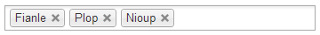
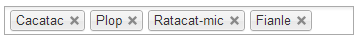

# Chosen order plugin

Chosen Order is a plugin for Chosen which aims to provide functions to handle the order of the selection.

Typically, you may want to retrieve the order in which the elements were selected with Chosen. You also may want to force the order in which Chosen displays the selected options. Unfortunately, Chosen does not handle that, because DOM Multiple Select elements do not have any notion of order of selection.

Created by [Tristan Jahier](http://tristan-jahier.fr).


-------------------------

THIS SOFTWARE IS NOT ASSOCIATED WITH **HARVEST** IN ANY WAY.

Chosen is a library originally created by [Patrick Filler](http://patrickfiller.com) for [Harvest](http://getharvest.com/).

-------------------------


## Compatibility

- jQuery : `1.4+`
- Prototype : `1.7.1+`
- Chosen : `1.0.0+`

### Internet Explorer 8

Chosen Order is now compatible with IE8, but you'll still need to add the [es5-shim](https://github.com/es-shims/es5-shim) script to your page in order to make it work.

```html
<!--[if lte IE 8]>
    <script type="text/javascript" src="workingdirectory/vendor/es5-shim.min.js"></script>
<![endif]-->
```

## Demo

You can see a demonstration of the plugin at : [http://labo.tristan-jahier.fr/chosen_order](http://labo.tristan-jahier.fr/chosen_order)

#### Hey! Demo in the `public/` directory does not work!!!

Use the `grunt` command to compile the project, and a task will fill this directory with the freshly built Javascript files.

If you have no idea what I'm talking about, just copy `chosen.order.jquery.min.js` and `chosen.order.proto.min.js` from `dist/` to `public/`.


## Usage

Download the compiled Javascript files (development and minified versions are available) from the `dist/` directory, or compile the project yourself.

Import the Javascript file in your HTML document. Choose the version which corresponds to the framework of your choice: jQuery or Prototype.

```html
<script type="text/javascript" src="chosen.order.jquery.min.js"></script>
```

or

```html
<script type="text/javascript" src="chosen.order.proto.min.js"></script>
```

Let's say you have a select element into your page, which is handled by Chosen:

```html
<select id="my-list" multiple>
	<option value="fianle" selected>Fianle</option>
	<option value="plop" selected>Plop</option>
	<option value="zorp">Zorp</option>
	<option value="catakt">Catakt</option>
	<option value="cacatac">Cacatac</option>
	<option value="nioup" selected>Nioup</option>
	<option value="ratacat-mic">Ratacat-mic</option>
</select>
```

So, you have 3 values selected : *Fianle*, *Plop* and *Nioup*. Chosen UI displays them in the order they are declared into the DOM:



Chosen Order provides two public functions, in two flavors each.

- **Functional flavor** is a direct call to ChosenOrder static functions.

	```javascript
	ChosenOrder.theFreakingFunction(element, params);
	```

- **Object-oriented flavor** is another approach that extends the objects.

	```javascript
	$(element).theFreakingFunction(params);
	```

### Retrieving the order

```javascript
// Functional flavor
var selection = ChosenOrder.getSelectionOrder(document.getElementById('my-list'));

// Object-oriented flavor, example for jQuery plugin
var selection = $('#my-list').getSelectionOrder();
```

`getSelectionOrder()` takes no argument and **returns an array of the selected values** in the order they appear in Chosen UI.
For the above example, it should return `["fianle", "plop", "nioup"]`.


### Setting the order

```javascript
var order = ['nioup', 'plop', 'fianle']; // Ordered options values

// Functional flavor
ChosenOrder.setSelectionOrder($('#my-list'), order);

// Object-oriented flavor, example for jQuery plugin
$('#my-list').setSelectionOrder(order);
```

`setSelectionOrder()` takes **an array of ordered values**.

It also takes an optional argument : `force`, which is a boolean. Default value is `false`. Set it to `true` if you plan to pass an array of ordered values that are not necessarily all selected yet.

For example, let's introduce *Cacatac* and *Ratacat-mic* and get rid of *Zorp*:

```javascript
var order = ['cacatac', 'plop', 'ratacat-mic', 'fianle'];
$('#my-list').setSelectionOrder(order, true);
```

It forces the selection of the values for the Select element and Chosen UI before ordering them.




## Technical aspects

Chosen Order does several precaution checks on the arguments. It checks if the element is a correct **multiple select element, with a matching Chosen UI**. If this is not the case, it outputs an error in the console:

	ChosenOrder::getSelectionOrder: first argument must be a valid HTML Multiple Select element that has been Chosenified!

It also checks if the order array is a true Array object, else, it screams:

	ChosenOrder::setSelectionOrder: second argument must be an Array!

Chosen Order handles both DOM raw elements and jQuery objects. For example, these 2 lines will work:

```javascript
ChosenOrder.getSelectionOrder(document.getElementById('my-list'));
ChosenOrder.getSelectionOrder($('#my-list'));
```

`setSelectionOrder()` trims the values of the order array.
